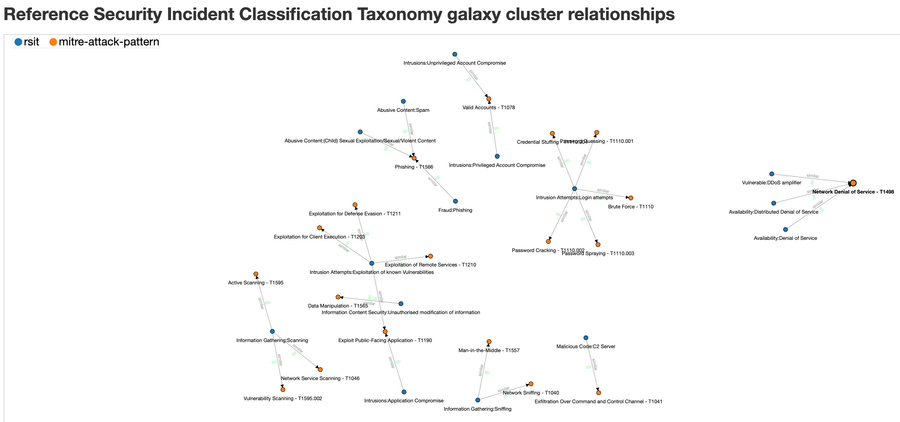

# RSIT and ATT&CK

Create a link between the classifications in [RSIT](https://github.com/enisaeu/Reference-Security-Incident-Taxonomy-Task-Force) and [ATT&CK](https://attack.mitre.org).

# Usage

## RSIT MISP Taxonomy

The RSIT MISP taxonomy contains an extra field **attck**. The field is not used by MISP taxonomy processing but only used to generate the human readable table and the relationship to the ATT&CK techniques. The value supports a **list** of one or more ATT&CK techniques.

For example
```
"attck": [ 
    { "dest-uuid": "d74c4a7e-ffbf-432f-9365-7ebf1f787cab", "MITRE": "T1498 -  Network Denial of Service"}
]
```

## Add / Edit a link with ATT&CK

Edit the RSIT MISP taxonomy file (machinetag.json).

## Create the human readable table

```
python3 machinetag2human.py machinetag.json rsit_2_attck.md
```

## Create the MISP Galaxy/Cluser

```
python3 convert-rsit-to-attck.py
```

This will read the taxonomy file and output the galaxy and cluster file. Copy the files and update the galaxies of MISP.

# Example of MISP RSIT <> ATT&CK relations




